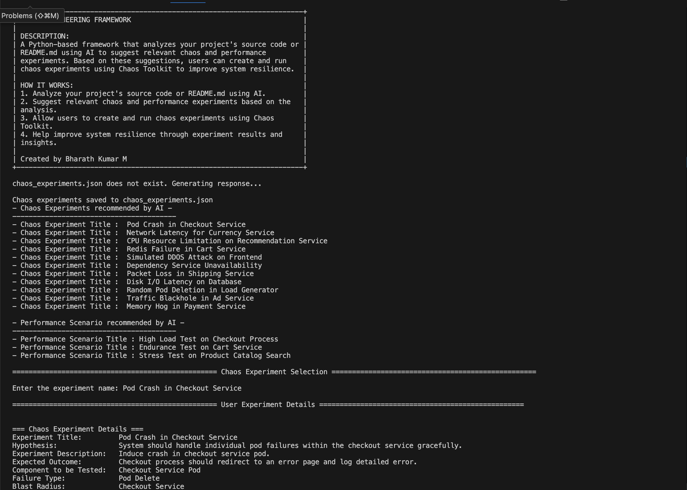
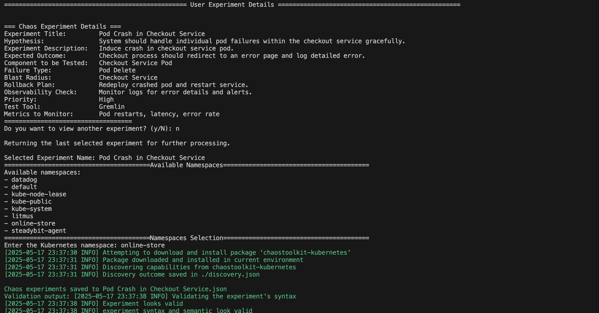
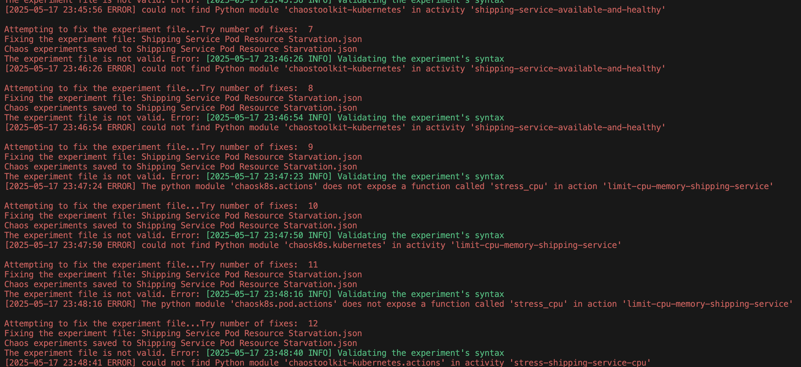

# Chaos Engineering Framework
This framework is designed for users with little or no knowledge of chaos engineering. It helps you plan, design, and validate chaos engineering experiments for your Kubernetes applications with minimal effort. By leveraging AI, the framework automatically analyzes your application's documentation, generates tailored chaos experiments and performance scenarios, and guides you through the process of selecting, customizing, and validating these experiments. This makes chaos engineering accessible and easy to adopt, even for teams new to the practice.

## What Does It Do?

- **Reads your application's documentation:** The framework scans your source files or `README.md` to understand your application's architecture and behavior.
- **AI-powered experiment generation:** Using the gathered information, the AI generates:
  - 10 chaos engineering experiments tailored to your application.
  - 5 performance scenarios for your application.
- **Guided experiment selection:** You can review the list of AI-generated experiments and scenarios to understand their purpose and impact.
- **Experiment code generation:** Select any experiment, and the AI will generate the corresponding chaos experiment code for you.
- **Automated validation:** The generated experiment is validated for correctness. If issues are found, the AI will iteratively fix them until the experiment is valid and ready to use.

## Supported Chaos Tools

- [Chaos Toolkit](https://chaostoolkit.org/) for Kubernetes

## Requirements

- Python installed on your system
- A running Kubernetes cluster
- Your application deployed using the Kubernetes deployment model

## Project Structure

```
Chaos Engineering Framework
├── src
│   ├── app.py                # Main entry point of the application
│   ├── utils                 # Utility functions for various tasks
│   │   ├── file_processor.py  # Functions for processing files and folders
│   │   ├── openai_api.py      # Functions for interacting with the OpenAI API
│   │   └── env_loader.py      # Functions for loading environment variables
│   └── prompts               # Contains user prompts for the AI model
│       └── user_prompt.py     # Structured prompt for generating chaos experiments
├── tests                     # Unit tests for the application
│   ├── test_file_processor.py  # Tests for file processing functions
│   ├── test_openai_api.py      # Tests for OpenAI API functions
│   └── test_env_loader.py      # Tests for environment variable loading functions
├── requirements.txt          # Project dependencies
└── README.md                 # Project documentation
```

## Setup Instructions

1. **Clone the repository:**

   ```
   git clone <repository-url>
   ```

2. **Install dependencies:**
   Then install the required packages:

   ```
   pip install -r requirements.txt
   ```

3. **Environment Variables:**
   Create a `.env` file in the root directory and add the following variables:
   ```
   GENAI_URL=<your_openai_api_url>
   GENAI_API_KEY=<your_openai_api_key>
   ```

## Usage

1. Run the application:
   ```
   python src/app.py
   ```
2. The framework will process your application's documentation, generate chaos experiments and performance scenarios, and guide you through selecting and generating experiment code.
3. Generated experiments are validated and saved in `chaos_experiments.json`.

## Testing

To run the tests, use the following command:

```
pytest tests/
```

This will execute all unit tests and ensure that the application functions as expected.

## Screenshots

Below are some screenshots demonstrating the framework in action:

The two images below show the application successfully generating and running chaos experiments.

The following image demonstrates how the framework reads the code or `README.md` file and generates a list of tailored chaos experiments:



The following image shows the user selecting a specific experiment. The framework then generates the corresponding experiment file and validates it automatically:



The following image illustrates the retry mechanism used during the validation of chaos experiments:



## Contributing

Contributions are welcome! Please open an issue or submit a pull request for any enhancements or bug fixes.
